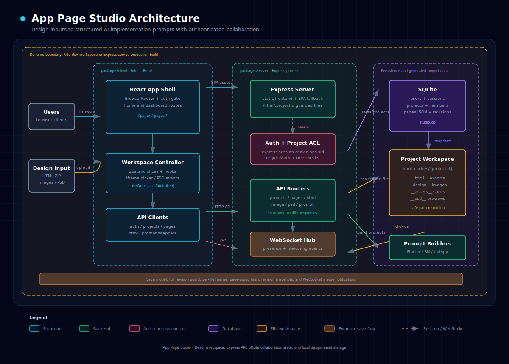

# App Page Studio

English | [简体中文](README.zh-CN.md)

App Page Studio is a workspace for turning design inputs into structured AI implementation prompts for Flutter, React Native, and UniApp page restoration.

It supports HTML exports, PNG/JPG/WebP design images, PSD previews and layer slicing, page grouping, interaction/slice/feature annotations, design-system metadata, multi-user collaboration, and revision history.

## Features

- **Multi-source design input**: Upload HTML ZIP files, image ZIP files or standalone images, and PSD or PSD ZIP files.
- **Page workspace**: Use a left file list, center phone preview or PSD canvas, and right page configuration panel.
- **Page grouping**: Group default, loading, empty, and other states of the same page.
- **Page configuration**: Configure state name, development status, route, source path, tab bar, data sources, and more.
- **Element picker**: Pick elements in HTML mode, or drag regions in design-image mode.
- **Interaction annotations**: Add tap, swipe, and other interaction descriptions to elements or regions.
- **Slice annotations**: Upload slice assets to `__assets__/`, or mark slices in PSD layers and canvas.
- **PSD workflow**: Generate PSD previews, inspect layers, mark slices, and keep slice data synchronized.
- **Feature annotations**: Mark native-capability areas such as scanning, maps, and camera usage.
- **Design system**: Maintain colors, spacing, radii, and other design rules for prompt generation.
- **Prompt generation**: Generate prompts for Flutter, React Native, or UniApp by development status or current page.
- **Login and permissions**: Support admins, users, project members, and owner/editor/viewer roles.
- **Multi-user collaboration**: Use WebSocket presence and synchronization for uploads, deletes, and saves.
- **Fine-grained saves**: Save the current page or the full project config to reduce collaboration conflicts.
- **Revision history**: Every save can create a pages-config revision that can be viewed and restored.
- **Dark and light themes**: Switch between UI themes.

## Architecture



## Quick Start

### Install Dependencies

The `dev` and `build` scripts run `pnpm install` automatically. You can also install manually:

```bash
pnpm install
```

### Development Mode

The repository uses a pnpm workspace for the backend and frontend. The Vite frontend proxies `/api`, `/html`, and `/ws` to the backend:

```bash
# Start the backend API / WebSocket server (3000) and Vite frontend (5173)
pnpm run dev
```

Open http://localhost:5173

### Build

Create a release ZIP package:

```bash
pnpm run build
```

Build output is written to `release/`. After extracting the release package, follow the bundled `README.txt` to start it.

### First Login

On first startup, if the database has no users, the server creates an admin account:

- Default username: `admin`
- Default password: if no environment variable is set, startup logs print a random password

You can set the initial admin account with environment variables:

```bash
BOOTSTRAP_ADMIN_USERNAME=admin BOOTSTRAP_ADMIN_PASSWORD=123456 pnpm --filter server start
```

Reset a specific account password to the default value `123456`:

```bash
pnpm --filter server reset-password -- -u <username>
```

## Workflow

### 1. Log In and Create a Project

After login, you enter the project home. Admins can manage users. Project owners and admins can manage project members.

When creating a project, you can upload a ZIP:

- HTML/HTM files are extracted to `__html__/`
- PNG/JPG/WebP files are extracted to `__design__/`
- PSD files are extracted to `__psd__/`

You can also create an empty project first, then upload HTML, design images, or PSD files in the workspace.

### 2. Open the Workspace and Refresh Files

Open a project through `/dashboard?pid=<projectId>`. The refresh action scans the current project for:

- HTML files under `__html__/`
- Design images under `__design__/`
- PSD files and previews under `__psd__/`

When other users upload or delete files, WebSocket broadcasts `files:changed`, and clients in the same project rescan the file list automatically.

### 3. Configure Page Groups

Select related files and create a page group. For example, group the default, loading, and empty states of the home page as "Home".

A page group can define:

- Name and description
- Route path
- Flutter / React Native / UniApp source paths
- Marker color

Page groups and file assignments share one conflict dimension, guarded by the group hash during save.

### 4. Configure a Single Page

After selecting a file, configure page information in the right panel:

- State name
- Page description
- Development status: todo / in progress / done
- Page group
- Tab bar configuration
- Data source configuration
- Interactions, slices, and feature descriptions

Single-page configuration uses a per-file conflict dimension. Multiple users can save different pages independently.

### 5. Mark Interactions, Slices, and Features

HTML mode:

- Click "Add interaction" and pick an element in the iframe
- Add interactions, slice annotations, feature descriptions, or inspect styles

Design-image mode:

- Drag a region on the image
- Add interactions, slices, or feature descriptions to the region

PSD mode:

- Use the PSD canvas and layer panel to locate content
- Mark slices on the canvas
- Save slice data to the current PSD page configuration

### 6. Save Configuration

The top bar provides two save entry points:

- **Save current page**: Save unsaved group changes first if needed, then save the current file configuration.
- **Save all**: Save the entire `pagesConfig`, useful for batch edits or global configuration changes.

Conflict control:

- Current-page saves use `entityHashes.files[path]` to check whether the target file changed remotely.
- Group saves use `entityHashes.groups` to check whether page groups or assignments changed remotely.
- Full saves use the global `revision` guard.

When another user saves the same page or group, WebSocket notifies the client and auto-merges when the local state is clean.

### 7. View Revision History

Every successful save advances the pages-config revision and stores a historical snapshot. You can view and restore snapshots from "Revision history".

### 8. Generate Prompts

Click "Generate prompt" and choose a target platform:

- Flutter
- React Native
- UniApp

You can filter by development status or generate only for the current page. For design-image pages, the prompt asks you to generate UI IR (JSON) according to `UI-IR-AGENT.md` first, then implement code from the IR.

## Project Structure

```text
app-page-studio/
├── package.json           # pnpm workspace scripts
├── pnpm-workspace.yaml
├── packages/
│   ├── server/
│   │   ├── server.js      # Express entry, session, static assets, WebSocket
│   │   ├── db.js          # SQLite schema and data-access modules
│   │   ├── paths.js       # workspace paths, data paths, frontend build paths
│   │   └── api/
│   │       ├── auth.js
│   │       ├── projects.js
│   │       ├── pages.js
│   │       ├── html.js
│   │       ├── image.js
│   │       ├── psd.js
│   │       ├── prompt.js
│   │       ├── prompt/
│   │       └── utils.js
│   └── client/
│       ├── index.html     # Vite entry
│       ├── vite.config.js # Vite proxy for /api, /html, /ws
│       └── src/
│           ├── main.jsx
│           ├── App.jsx
│           ├── pages/
│           ├── components/
│           ├── hooks/
│           ├── lib/
│           └── styles/
├── html_caches/
│   └── {projectId}/
│       ├── __html__/      # HTML design exports
│       ├── __design__/    # PNG/JPG/WebP design images
│       ├── __assets__/    # User-uploaded slice assets
│       └── __psd__/       # PSD files and generated PNG previews
└── studio.db              # SQLite database
```

## API Overview

Business APIs require login. Login state is stored through `express-session`.

- `POST /api/auth/login`, `POST /api/auth/logout`, `GET /api/auth/me`
- `GET/POST/PUT/DELETE /api/auth/users...`: admin user management
- `GET /api/projects`, `POST /api/projects`, `PUT /api/projects/:id`, `DELETE /api/projects/:id`
- `GET/POST/PUT/DELETE /api/projects/:id/members...`: project member management
- `GET /api/pages`: read pages config, revision, and entity hashes
- `POST /api/pages`: save the full config
- `PATCH /api/pages/file`: save one page config
- `PATCH /api/pages/groups`: save page groups and file assignments
- `GET /api/pages/history`, `POST /api/pages/restore`: revision history
- `POST /api/upload-html`, `GET /api/scan-html`, `GET /api/html-content`
- `POST /api/upload-image`, `GET /api/list-images`, `POST /api/upload-asset`
- `POST /api/upload-psd`, `GET /api/list-psd`, `GET /api/psd-preview`
- `POST /api/download-design-zip`
- `POST /api/generate-prompt`

## Collaboration and Save Model

Page configuration is still stored as one full JSON blob in `project_pages.pages_json`, but save entry points are split by conflict dimension:

- **Single-page information**: one `htmlFiles[]` entry identified by `path`, guarded by the file hash.
- **Group information**: `pageGroups[]` plus `groupId` and `isPrimaryState` assignments in `htmlFiles[]`, guarded by the group hash.
- **Global information**: the full config, guarded by `revision`.

WebSocket provides collaboration awareness and synchronization:

- Presence shows collaborators on the current project, page, or group.
- Uploading or deleting HTML, design images, or PSD files broadcasts `files:changed`.
- Saving the current page broadcasts `pages:file-saved`.
- Saving groups broadcasts `pages:groups-saved`.
- Saving the full config broadcasts `pages:full-saved`.
- Filesystem changes in HTML/PSD files broadcast `html:changed`.

## Tech Stack

- **Backend**: Node.js, Express, express-session, WebSocket
- **Database**: SQLite, better-sqlite3, better-sqlite3-session-store
- **File processing**: Multer, ADM-Zip, archiver, Chokidar
- **PSD processing**: psd for backend previews, ag-psd for frontend parsing
- **Frontend**: Vite, React, React Router, Zustand, HeroUI, Tailwind CSS

## Prompt Usage Suggestions

After generating prompts, place the corresponding design resources in the target project and put `UI-IR-AGENT.md` at the Flutter / React Native / UniApp project root.

Suggested batch workflow:

1. Mark pages to implement as "in progress".
2. Generate prompts only for the current page or current development status.
3. Confirm slice asset paths and source paths are configured.
4. After AI generates code, manually review styles, routing, state management, and API logic.

## FAQ

**Q: What should I do if preview does not show?** A: Confirm you are logged in, have project access, and have uploaded HTML, design images, or PSD files. Click "Refresh" to rescan.

**Q: Why can other users not see the design image I uploaded?** A: A successful upload broadcasts file changes through WebSocket. If a client was disconnected, click "Refresh" to rescan the file list.

**Q: Why does saving the current page report a conflict?** A: Another user has already saved the same page. Load the latest version, then merge your changes.

**Q: When should I use save all?** A: Use it for batch edits, global design-system changes, or broad configuration changes. In daily collaboration, prefer "Save current page".

**Q: Can a viewer edit?** A: No. Viewers are read-only. Owners and editors can save, and owners plus admins can manage project members.

## License

MIT
