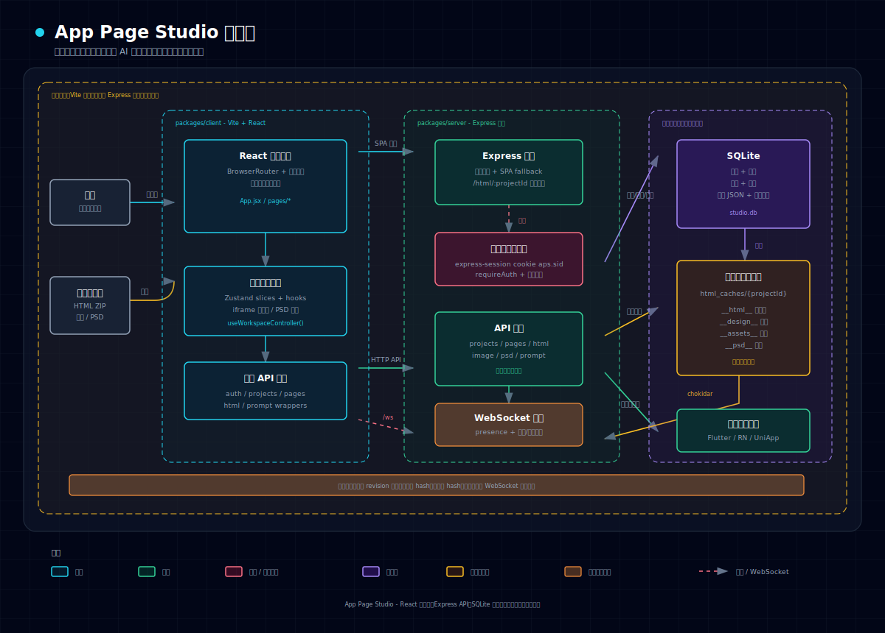

# App Page Studio

[English](README.md) | 简体中文

App Page Studio 是一个把设计稿输入转换为 AI 开发提示词的工作台，面向
Flutter、React Native 和 UniApp 页面还原。

它支持 HTML 设计稿、PNG/JPG/WebP 设计图、PSD
文件预览与图层切图，并提供页面分组、交互/切图/功能描述、设计系统、多人协作和版本历史。

## 功能特性

- **多源设计稿**：支持 HTML ZIP、设计图 ZIP/图片上传、PSD/PSD ZIP 上传。
- **页面工作台**：左侧文件列表，中间手机预览/PSD 画布，右侧页面配置面板。
- **页面分组**：把同一页面的默认、加载中、空数据等状态归为一个页面组。
- **页面配置**：配置状态名称、开发状态、路由、源码路径、Tabbar、数据源等。
- **元素选择器**：HTML 模式可点选元素；设计图模式可拖拽选区。
- **交互配置**：为元素或区域添加点击、滑动等交互描述。
- **切图标记**：上传切图资源到 `__assets__/`，或在 PSD 图层/画布中标记切图。
- **PSD 工作流**：上传 PSD 后生成预览，支持图层面板、切图标记、切图数据同步。
- **功能描述**：标记扫码、地图、摄像头等需要原生能力实现的区域。
- **设计系统**：维护颜色、间距、圆角等设计规范，生成提示词时自动带入。
- **提示词生成**：支持 Flutter、React Native、UniApp，可按开发状态或当前页生成。
- **登录与权限**：支持管理员、用户、项目成员，项目成员角色包含
  owner/editor/viewer。
- **多人协作**：WebSocket
  显示项目/页面协作者，上传、删除、保存后自动同步相关信息。
- **细粒度保存**：支持“保存当前页”和“保存全部”，降低多人编辑不同页面时的冲突。
- **历史版本**：保存会产生页面配置版本，可查看并恢复历史版本。
- **深色/浅色主题**：支持主题切换。

## 架构图



## 快速开始

### 安装依赖

`dev` 和 `build` 脚本会自动执行 `pnpm install`。也可以手动安装：

```bash
pnpm install
```

### 开发模式

根目录使用 pnpm workspace 管理后端和前端。Vite 前端会代理 `/api`、`/html`、`/ws`
到后端：

```bash
# 同时启动后端 API / WebSocket（3000）和 Vite 前端（5173）
pnpm run dev
```

访问 http://localhost:5173

### 打包

生成发布 ZIP 包：

```bash
pnpm run build
```

产物输出到 `release/`。解压发布包后按包内 `README.txt` 启动。

### 首次登录

首次启动时，如果数据库中没有用户，服务端会创建管理员账号：

- 默认用户名：`admin`
- 默认密码：如果未设置环境变量，启动日志会打印随机密码

可通过环境变量指定初始管理员：

```bash
BOOTSTRAP_ADMIN_USERNAME=admin BOOTSTRAP_ADMIN_PASSWORD=123456 pnpm --filter server start
```

重置指定账号密码为默认值 `123456`：

```bash
pnpm --filter server reset-password -- -u <username>
```

## 使用流程

### 1. 登录并创建项目

登录后进入项目首页。管理员可以管理用户；项目 owner 或管理员可以管理项目成员。

创建项目时可以上传 ZIP：

- 包含 HTML/HTM 文件时会解压到 `__html__/`
- 包含 PNG/JPG/WebP 时会解压到 `__design__/`
- 包含 PSD 时会解压到 `__psd__/`

也可以先创建空项目，再在工作台上传 HTML、设计图或 PSD。

### 2. 打开工作台并刷新文件

项目通过 `/dashboard?pid=<projectId>` 打开。点击“刷新”会扫描当前项目的：

- `__html__/` 下的 HTML 文件
- `__design__/` 下的设计图
- `__psd__/` 下的 PSD 文件和预览

其他用户上传或删除文件后，WebSocket 会广播
`files:changed`，当前项目内的客户端会自动重新扫描文件列表。

### 3. 配置页面组

选择多个相关文件，创建页面组。例如把首页默认态、加载态、空态归到“首页”。

页面组可配置：

- 名称和描述
- 路由路径
- Flutter / React Native / UniApp 源码路径
- 标记颜色

页面组和文件归属属于同一个冲突维度，保存时走分组 hash 校验。

### 4. 配置单页信息

选择文件后，在右侧配置单页信息：

- 状态名称
- 页面描述
- 开发状态：待开发 / 开发中 / 已完成
- 所属页面组
- Tabbar 配置
- 数据源配置
- 交互、切图、功能描述

单页配置属于单文件冲突维度。多人编辑不同页面时，可以分别保存当前页。

### 5. 标记交互、切图和功能

HTML 模式：

- 点击“添加交互”后在 iframe 中点选元素
- 可添加交互、切图标记、功能描述，或查看样式

设计图模式：

- 在图片上拖拽选区
- 为区域添加交互、切图或功能描述

PSD 模式：

- 使用 PSD 画布和图层面板定位内容
- 在画布上标记切图
- 切图数据保存到当前 PSD 页面配置中

### 6. 保存配置

顶部有两个保存入口：

- **保存当前页**：先保存未保存的分组变更，再保存当前文件配置。
- **保存全部**：保存整个 `pagesConfig`，用于批量调整或全局配置变更。

冲突控制：

- 当前页保存使用 `entityHashes.files[path]` 校验目标文件是否被别人改过。
- 分组保存使用 `entityHashes.groups` 校验页面组和文件归属是否被别人改过。
- 保存全部使用全局 `revision` 校验。

当其他用户保存相同页面或分组时，WebSocket 会提示并在本地未修改时自动合并。

### 7. 查看历史版本

每次成功保存都会推进页面配置
revision，并保留历史快照。可以在“历史版本”中查看并恢复。

### 8. 生成提示词

点击“生成提示词”，选择目标平台：

- Flutter
- React Native
- UniApp

可按开发状态筛选，也可只生成当前页。设计图页面会提示先按 `UI-IR-AGENT.md` 生成
UI IR(JSON)，再基于 IR 实现代码。

## 项目结构

```text
app-page-studio/
├── package.json           # pnpm workspace scripts
├── pnpm-workspace.yaml
├── packages/
│   ├── server/
│   │   ├── server.js      # Express 服务入口，Session，静态资源，WebSocket
│   │   ├── db.js          # SQLite schema 和数据访问模块
│   │   ├── paths.js       # workspace 路径、数据目录和前端构建目录
│   │   └── api/
│   │       ├── auth.js
│   │       ├── projects.js
│   │       ├── pages.js
│   │       ├── html.js
│   │       ├── image.js
│   │       ├── psd.js
│   │       ├── prompt.js
│   │       ├── prompt/
│   │       └── utils.js
│   └── client/
│       ├── index.html     # Vite 入口
│       ├── vite.config.js # Vite 代理 /api、/html、/ws
│       └── src/
│           ├── main.jsx
│           ├── App.jsx
│           ├── pages/
│           ├── components/
│           ├── hooks/
│           ├── lib/
│           └── styles/
├── html_caches/
│   └── {projectId}/
│       ├── __html__/      # HTML 设计稿
│       ├── __design__/    # PNG/JPG/WebP 设计图
│       ├── __assets__/    # 用户上传切图资源
│       └── __psd__/       # PSD 文件和生成的 PNG 预览
└── studio.db              # SQLite 数据库
```

## API 概览

业务 API 均需要登录，登录态通过 `express-session` 保存。

- `POST /api/auth/login`、`POST /api/auth/logout`、`GET /api/auth/me`
- `GET/POST/PUT/DELETE /api/auth/users...`：管理员用户管理
- `GET /api/projects`、`POST /api/projects`、`PUT /api/projects/:id`、`DELETE /api/projects/:id`
- `GET/POST/PUT/DELETE /api/projects/:id/members...`：项目成员管理
- `GET /api/pages`：读取页面配置、revision 和 entity hash
- `POST /api/pages`：保存全部配置
- `PATCH /api/pages/file`：保存单页配置
- `PATCH /api/pages/groups`：保存页面组和文件归属
- `GET /api/pages/history`、`POST /api/pages/restore`：历史版本
- `POST /api/upload-html`、`GET /api/scan-html`、`GET /api/html-content`
- `POST /api/upload-image`、`GET /api/list-images`、`POST /api/upload-asset`
- `POST /api/upload-psd`、`GET /api/list-psd`、`GET /api/psd-preview`
- `POST /api/download-design-zip`
- `POST /api/generate-prompt`

## 协作与保存模型

页面配置仍以完整 JSON 存在
`project_pages.pages_json`，但保存入口按冲突维度拆分：

- **单页信息**：`htmlFiles[]` 中某个 `path` 的配置，使用文件 hash。
- **分组信息**：`pageGroups[]` 加 `htmlFiles[]` 中的
  `groupId`/`isPrimaryState`，使用分组 hash。
- **全局信息**：整个配置，使用 revision。

WebSocket 负责协作感知和同步：

- presence 显示当前项目、页面、分组上的协作者。
- 上传/删除 HTML、设计图、PSD 后广播 `files:changed`。
- 保存当前页后广播 `pages:file-saved`。
- 保存分组后广播 `pages:groups-saved`。
- 保存全部后广播 `pages:full-saved`。
- 文件系统中的 HTML/PSD 变化会广播 `html:changed`。

## 技术栈

- **后端**：Node.js、Express、express-session、WebSocket
- **数据库**：SQLite、better-sqlite3、better-sqlite3-session-store
- **文件处理**：Multer、ADM-Zip、archiver、Chokidar
- **PSD 处理**：psd（后端预览）、ag-psd（前端解析）
- **前端**：Vite、React、React Router、Zustand、HeroUI、Tailwind CSS

## 提示词使用建议

生成提示词后，将对应设计稿资源放到目标项目中，并把 `UI-IR-AGENT.md` 放在 Flutter
/ React Native / UniApp 项目根目录。

建议按页面组分批生成和实现：

1. 把要开发的页面标记为“开发中”。
2. 只生成当前页或当前开发状态的页面。
3. 确认切图资源路径和源码路径已经配置。
4. 让 AI 生成代码后，人工审查样式、路由、状态管理和接口逻辑。

## 常见问题

**Q: 预览不显示怎么办？** A: 确认已登录、有项目权限，并且项目内已上传
HTML、设计图或 PSD。点击“刷新”重新扫描。

**Q: 上传设计图后别人看不到怎么办？** A: 上传成功会通过 WebSocket
广播文件变更。若客户端断线，点击“刷新”会重新扫描文件列表。

**Q: 为什么保存当前页提示冲突？** A:
其他用户已经保存过同一页。加载最新版本后再合并你的修改。

**Q: 什么时候用保存全部？** A:
批量调整、全局设计系统或大范围配置变更时使用。日常多人协作优先用“保存当前页”。

**Q: viewer 能编辑吗？** A: 不能。viewer 只读；owner/editor 可以保存，owner
和管理员可以管理项目成员。

## License

MIT
